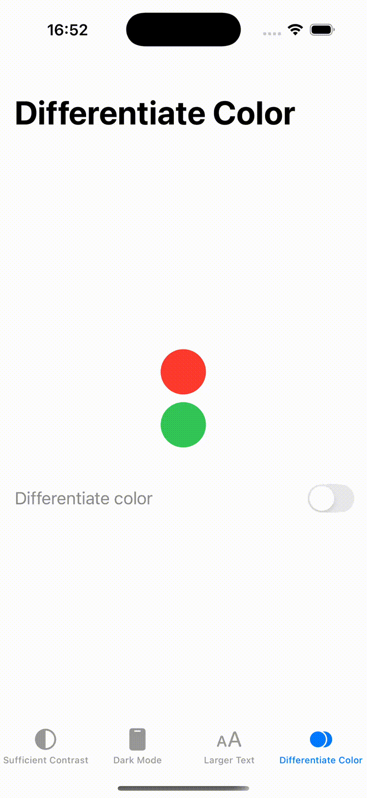

# Accessibility
Sample iOS that implements several accessibility flavors This is the basecode for following post [Visual Accessibilty in iOS](https://javios.eu/uncategorized/visual-accessibilty-in-ios/) and [Interaction and Media Accessibility in iOS](https://javios.eu/accessibility/interaction-and-media-accessibility-in-ios/)

## Appareance
 

## Voice Over

## Voice Control

## ✨ Visual accessibility nutrition labels covered

- ✅ Sufficient Contrast
- ✅ Dark mode
- ✅ Larger text
- ✅ Differentiate Color
- ✅ Reduced Motion

##  Visual accessibility nutrition labels NOT covered
- ❌ Voice Control
- ❌ Voice Over
- ❌ Captions
- ❌ Audio descriptions

## Requirements

- **Xcode 15.0 or later**
- **iOS 16.0 or later**

## 🔖 License

This project is licensed under the MIT License.  
See the [LICENSE](./LICENSE) file for details.

